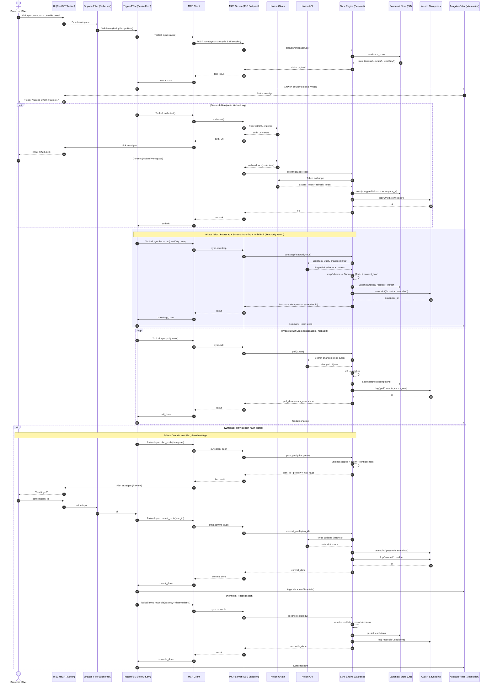

# Full Sync Terra Nova MCP Sequence

Status: captured architecture note

## Purpose

This note preserves the client-side Mermaid sequence diagram for the
`/full_sync_terra_nova_lovable_ferrai` flow. It covers read-only status checks,
Notion OAuth bootstrap, initial pull, recurring diff pulls, later writeback with
two-step confirmation, and deterministic reconciliation.

## Rendering Note

The source page renders this sequence diagram client-side with Mermaid.js v10+.
When switching to the Sequence tab, the diagram should be rendered again so
mobile browsers do not end up with an empty SVG after tab activation.

## Raw Mermaid

