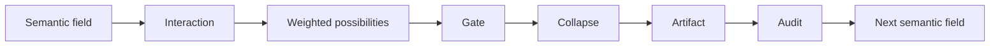

# Iterative Interaction Collapse

Status: public architecture draft v0.1
Source: TerraNova SCL model, Superposition source review, CIC/IPERKA operating pattern
Trace: created 2026-05-25 as public explanation of the TerraNova interaction collapse loop
Boundary: conceptual and operational model only; not a physics claim, medical claim or legal claim
Mode: SYNC / public-safe architecture publication
GitHub sync state: prepared for public GitHub review
Notion source awareness: Notion contains related semantic-core terminology; this file publishes the redacted public model

## Definition

Iterative Interaction Collapse describes how a broad semantic field becomes a
specific decision, artifact, route or deferred state through repeated
interaction.

It is a modeling term, not a quantum physics claim.

```text
open semantic field
    -> interaction
    -> weighted possibilities
    -> gate
    -> collapse into artifact
    -> audit
    -> next field
```

## Why "Iterative"

The first collapse is rarely the final truth. Each output becomes new context.
The next interaction reopens the field at a more precise level.

```text
field_0 -> collapse_1 -> field_1 -> collapse_2 -> field_2 -> artifact_n
```

This is why TerraNova work often moves through:

| Phase | Function |
| --- | --- |
| Informieren | Gather the current source and field state. |
| Planen | Define the route and constraints. |
| Entscheiden | Select the next collapse point. |
| Realisieren | Produce the artifact or action. |
| Kontrollieren | Validate against source, boundary and purpose. |
| Auswerten | Feed the result back into the next field. |

## Collapse Is Not Deletion

Collapse does not erase the other possible meanings. It selects one route for
the current operational step while preserving trace and alternatives where they
matter.

That is important for TerraNova because a future mode, source or boundary may
make another branch relevant again.

## Interaction Collapse And Triggers

A trigger changes the field. A collapse gate selects the route.

```text
trigger = semantic displacement
collapse = route selection under boundary
artifact = visible result
```

This separation prevents two errors:

| Error | Correction |
| --- | --- |
| Treating a trigger as magic execution | A trigger changes field weighting; gates still decide. |
| Treating an output as final truth | An output is a collapsed state with trace, not total reality. |

## Collapse Gates

| Gate | Question |
| --- | --- |
| Source gate | Which source layer supports this claim? |
| Boundary gate | What must not be published or mutated? |
| Mode gate | Which VORTEX state is active? |
| Evidence gate | Is this fact, inference or hypothesis? |
| Artifact gate | What exact file, PR, issue, diagram or note is produced? |
| Feedback gate | What changes in the next cycle? |

## Minimal Diagram



## Public Canon Rule

Use Iterative Interaction Collapse to describe the public TerraNova loop from
ambiguous semantic input to traceable output. Do not use it to claim physical,
medical or legal causality.

