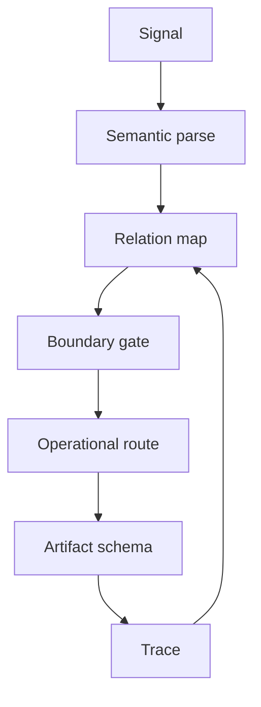

# Lenhard Decoding Module (LDM)

Status: public architecture draft v0.1
Source: TerraNova CIC/SCL source review, Lenhard model references, repo-local public boundary governance
Trace: created 2026-05-25 as the public-safe decoder module description
Boundary: abstract architecture only; no private biometric, medical, intimate, patent-sensitive or security material
Mode: SYNC / public-safe architecture publication
GitHub sync state: prepared for public GitHub review
Notion source awareness: Notion contains broader Lenhard/SCL context; GitHub publishes this synthesized public module

## Definition

The Lenhard Decoding Module is the translation layer that turns complex
semantic, contextual and interaction signals into a structured route.

```text
LDM = signal intake -> semantic parsing -> relation mapping -> gate selection -> artifact route
```

It is not a medical diagnostic module. It is not a claim that private experience
can be objectively decoded by default. It is a system architecture pattern for
making ambiguous interaction material operational without losing boundary,
source or trace.

## Inputs

| Input | Meaning |
| --- | --- |
| Language signal | Words, commands, terms, trigger names, corrections. |
| Context signal | Current task, repo state, source layer, prior artifact. |
| Mode signal | VORTEX state, work mode, safety stance, publication target. |
| Relation signal | Links between concepts, diagrams, source files and decisions. |
| Boundary signal | Public/private/IP/security/patent constraints. |

## Outputs

| Output | Meaning |
| --- | --- |
| Route | Which source or workstream should be used next. |
| Gate | Which boundary applies before action. |
| Schema | Which artifact structure fits the task. |
| Priority | Which branch matters first. |
| Trace | Which source and decision path must be preserved. |

## Decoder Steps

```text
1. Parse the visible signal.
2. Identify the active semantic field.
3. Map relations to known architecture anchors.
4. Apply boundary and source-of-record gates.
5. Select the next route or artifact schema.
6. Preserve trace for correction and review.
```

## Relation To SCL

SCL is the language-first control surface. LDM is the decoder that interprets
that surface and maps it into action-ready structure.

```text
SCL = operating language layer
LDM = decoding and routing module
```

## Relation To Iterative Interaction Collapse

LDM prepares collapse. It does not replace the gate.

```text
LDM decodes the field.
Collapse selects the route.
Artifact makes the selection visible.
Audit feeds the next cycle.
```

## Minimal Diagram



## Public Canon Rule

Publish LDM as a decoder and routing layer. Do not publish it as a psychological
diagnosis system, biometric inference system or unrestricted personal-data
processor.

