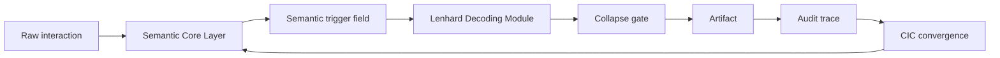

# Lenhard Model

Status: public architecture draft v0.1
Source: CIC convergence layer references, TerraNova SCL model, Lenhard Decoding Module draft
Trace: created 2026-05-25 as public model layer for TerraNova transformation logic
Boundary: architecture and reasoning model only; no legal, medical, patent grant or financial claim
Mode: SYNC / public-safe architecture publication
GitHub sync state: prepared for public GitHub review
Notion source awareness: Notion contains additional model fragments; this file publishes the redacted GitHub spine

## Definition

The Lenhard Model is the public TerraNova transformation model for moving from
raw interaction and semantic ambiguity toward structured, source-aware,
auditable artifacts.

```text
raw signal -> semantic field -> decoder -> collapse gate -> artifact -> trace -> next field
```

It sits above individual modules such as SCL, LDM and Mermaid Cluster. Its role
is to describe how those modules cooperate.

## Core Components

| Component | Role |
| --- | --- |
| SCL | Language-first operating layer. |
| Semantic Trigger Architecture | Field distortion and route bias. |
| LDM | Decoding from signal/context into route and schema. |
| Iterative Interaction Collapse | Selection of a concrete next state. |
| Mermaid Cluster | Visual graph layer for module/entity/edge relations. |
| CIC | Coherence and convergence frame across human, AI and artifact layers. |

## Transformation Loop



## Relation To CIC

In the local CIC convergence model, the Lenhard layer appears as a transformation
layer. Publicly, that means:

```text
Lenhard Model = transformation logic for converting interaction into coherent artifacts
```

It does not replace CIC. It operates inside the CIC frame as the translation and
transformation logic between interaction, system memory, trigger fields and
published artifacts.

## Relation To TNPX-01

TNPX-01 is treated as development context around Codex Gateway and semantic
control work. The Lenhard Model public release does not publish internal patent
claims, filing drafts or protected submodule mechanics.

The public relation is:

```text
TNPX-01 context -> Codex Gateway / semantic control history
Lenhard Model -> public transformation architecture
```

## What The Model Claims

The public Lenhard Model claims:

| Claim | Status |
| --- | --- |
| Language can act as an operating surface in a structured AI workspace. | Architecture claim. |
| Triggers can be modeled as semantic field operators. | Architecture claim. |
| Interaction can be iteratively collapsed into traceable artifacts. | Workflow claim. |
| Visual graphs can encode state, guard and route relations. | Documentation/modeling claim. |

## What The Model Does Not Claim

| Non-claim | Reason |
| --- | --- |
| Granted patent protection | Patent status is outside this public architecture draft. |
| Medical diagnosis or treatment | The model is an architecture and workflow frame. |
| Hidden connector authorization | Runtime access and mutation permission remain policy-controlled. |
| Complete trigger canon publication | Private and protected trigger material remains gated. |

## Public Canon Rule

Use the Lenhard Model as the umbrella model for TerraNova's transformation
logic. Use SCL, LDM, trigger architecture, interaction collapse and Mermaid
Cluster for the concrete sublayers.

