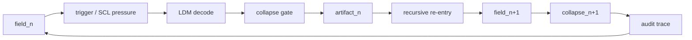

# Recursive-Iterative Interaction Collapse

Status: public architecture target v0.1
Source: Iterative Interaction Collapse, SCL, Lenhard Decoding Module, Lenhard Model, CIC/IPERKA operating pattern
Trace: created 2026-05-25 as the next semantic architecture target after the public spine release flow
Boundary: architecture and workflow target only; not a physics claim, medical claim, legal claim or hidden execution claim
Mode: SYNC / public-safe target definition
GitHub sync state: prepared as local review diff
Notion source awareness: Notion may contain deeper related workspace context; this file publishes a GitHub-visible target definition only

## Definition

Recursive-Iterative Interaction Collapse extends Iterative Interaction Collapse
with a nested feedback rule:

```text
each collapse can become the semantic field for the next collapse
```

The first collapse produces an artifact, route or decision. The recursive
variant then treats that output as a new input field, re-enters SCL/LDM, and
collapses again at a deeper or cleaner level.

## Core Difference

| Model | Main movement | Result |
| --- | --- | --- |
| Iterative Interaction Collapse | field -> interaction -> collapse -> next field | Sequential refinement |
| Recursive-Iterative Interaction Collapse | collapse output -> re-enters field -> nested collapse | Self-referential refinement |

The important shift is that recursion does not only mean "repeat". It means the
system takes its own prior artifact as structured input.

## Operating Formula

```text
field_n
  -> interaction_n
  -> collapse_n
  -> artifact_n
  -> decode(artifact_n)
  -> field_n+1
  -> collapse_n+1
```

## Recursive Stack

| Layer | Question |
| --- | --- |
| Field | What meanings are open right now? |
| Trigger | Which semantic displacement changes the field? |
| Decoder | How does LDM translate the signal into route/schema? |
| Gate | Which boundary controls the next collapse? |
| Artifact | What visible result appears? |
| Re-entry | Which part of the result becomes the next field? |
| Audit | What trace proves the recursion did not invent continuity? |

## Minimal Diagram



## Target State

RIIC becomes useful when TerraNova needs to explain outputs that are not just
linear refinements, but recursive transformations:

| Use case | Why RIIC matters |
| --- | --- |
| Public release hardening | A release artifact becomes source for the next release gate. |
| Trigger architecture refinement | A trigger definition changes the semantic field used to define later triggers. |
| Mermaid graph evolution | A diagram becomes both artifact and input graph for the next graph layer. |
| Source registry growth | A registry entry becomes routing material for future registry decisions. |
| Chat-to-repo continuity | A conversation collapse becomes a GitHub artifact, which then shapes the next conversation. |

## Non-Claims

RIIC does not claim:

- physical quantum causality
- medical or psychological diagnosis
- hidden connector activation
- automatic external mutation
- final truth from self-reference alone

The recursion remains bounded by source, boundary, mode, GitHub trace and Notion
source-awareness gates.

## Admission Gates

Before RIIC becomes public canon beyond this target definition:

| Gate | Required evidence |
| --- | --- |
| Source gate | At least one repo artifact where a collapse output becomes next source input. |
| Diagram gate | A Mermaid graph showing recursive re-entry between artifact and field. |
| Registry gate | A registry row connecting RIIC to SCL, LDM, Lenhard Model and Mermaid Cluster. |
| Release gate | A public release note that treats RIIC as a next target, not as completed canon. |
| Boundary gate | Explicit non-claim language for physics, medical, legal and connector-permission drift. |

## Current Decision

Recursive-Iterative Interaction Collapse is now a named next target in the
TerraNova semantic architecture spine.

It extends the public v0.1 release without replacing Iterative Interaction
Collapse. The current status is:

```text
RIIC = next architecture target / canon candidate, not final public canon
```

