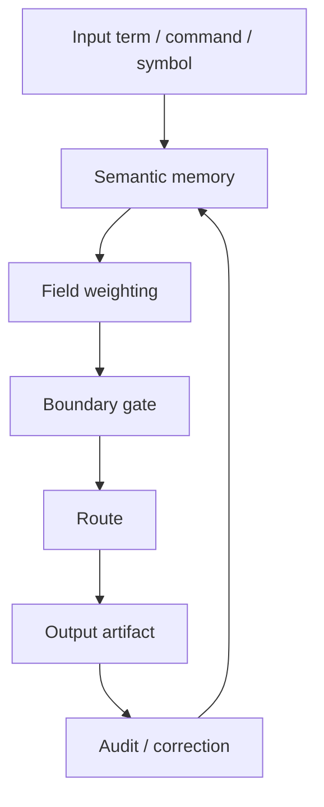

# Semantic Core Layer (SCL)

Status: public architecture draft v0.1
Source: TerraNova system-model reference, Notion SCL source review, repo-local trigger definition draft
Trace: created 2026-05-25 as the public SCL anchor for the semantic trigger spine
Boundary: language/control model only; no private memory dump, no raw prompt library, no Schattenarchiv detail
Mode: SYNC / public-safe architecture publication
GitHub sync state: prepared for public GitHub review
Notion source awareness: Notion remains the living workspace for expanded SCL terms; this file defines the public layer

## Definition

The Semantic Core Layer is the language-first control surface of TerraNova.

SCL treats words, commands, trigger names, diagrams, symbolic references and
mode labels as operational input surfaces, not decorative labels.

```text
SCL = language surface + semantic memory + routing pressure + boundary logic
```

## What SCL Controls

SCL does not execute by itself. It shapes interpretation before execution.

| Surface | SCL role |
| --- | --- |
| Slash commands | Enter a named semantic route. |
| Trigger IDs | Address a trigger family or semantic slot. |
| Mode words | Bias state selection, for example PROCESS, STUDIO, SAFE or SYNC. |
| Mermaid nodes | Externalize semantic modules as graph entities. |
| Edge labels | Express guard conditions and route logic. |
| Source names | Raise a source layer, such as Notion, GitHub or local repo context. |

## SCL And Superposition

Before a gate resolves the route, several possible interpretations can exist at
the same time. In TerraNova terms, a trigger may hold multiple valid states
across layer, mode and context.

SCL handles that by requiring the instance key:

```text
term + layer + mode + context + boundary
```

That key lets the same term behave differently without becoming incoherent.

## SCL And Public Documentation

Public documentation must not flatten SCL into a prompt collection.

Prompt thinking says:

```text
better prompt -> better answer
```

SCL thinking says:

```text
semantic field + source state + boundary + mode -> routed interpretation
```

The difference matters because TerraNova uses persistent terms as architecture
anchors across chats, repo files, Notion pages, diagrams and execution traces.

## SCL Boundary

SCL can change meaning and routing. It cannot bypass:

| Boundary | Effect |
| --- | --- |
| Public boundary | Blocks raw private, patent-sensitive or security material. |
| Connector policy | Blocks external mutation without explicit permission. |
| Source-of-record policy | Prevents GitHub from pretending to replace Notion where Notion remains canonical. |
| Truth/audit gate | Requires status, source and trace for durable claims. |

## Operating Loop



## Public Canon Rule

SCL is the public name for TerraNova's semantic operating layer. It should be
used whenever a document explains why a term, trigger, diagram or named mode can
change system behavior without being a direct executable command.

