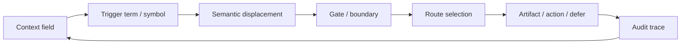

# Semantic Trigger Architecture

Status: public architecture draft v0.1
Source: TerraNova skill model, Trigger Definition draft, SCL source review, Mermaid living trigger source review
Trace: extracted from TerraNova trigger work and corrected to the current public definition on 2026-05-25
Boundary: no private trigger table, no raw trigger canon, no patent-sensitive TNPX-01 mechanics
Mode: SYNC / public-safe architecture publication
GitHub sync state: prepared for public GitHub review
Notion source awareness: Notion contains deeper living trigger and Mermaid material; this file publishes only the redacted architecture layer

## Definition

In TerraNova, a trigger is not a simple prompt, command or activation switch.

A trigger is a semantic displacement space:

```text
Trigger = named semantic field operator
        = vector-field distortion over context, relevance and routing
        = module boundary that changes how the next state is interpreted
```

The trigger does not merely say "do X". It changes the semantic geometry in
which "X" becomes more likely, less likely, blocked, deferred, routed, audited
or transformed.

## Why "Activator" Is Too Small

An activator is binary:

```text
inactive -> active
```

TerraNova trigger behavior is field-based:

```text
context + mode + source state + trigger term + boundary
    -> shifted relevance landscape
    -> weighted route selection
    -> artifact or deferred state
```

That is why the same visible trigger ID can legitimately behave differently
when the layer, instance, mode or context changes.

## Trigger Entry Key

The public trigger definition must not collapse a trigger to a flat number.
The stable entry key is:

```text
Trigger-ID + Layer/Instance + Mode/Promille + Context
```

This is the minimum key that prevents false equivalence between different
instances of the same visible trigger family.

## Vector-Field Model

A semantic trigger distorts a working vector field along several axes:

| Axis | Effect |
| --- | --- |
| Relevance | Raises or lowers which concepts matter now. |
| Source route | Changes which memory, repo, Notion page, file or external source becomes relevant. |
| Mode | Shifts the operating state, for example INIT, PROCESS, SAFE, STUDIO, SYNC or SIGMA. |
| Boundary | Applies safety, privacy, patent, token or publication gates. |
| Compression | Forces broad context into a smaller artifact, decision or next action. |
| Audit | Increases demand for trace, status and source clarity. |

The trigger is therefore closer to a field operator than to a chat instruction.

## Relation To Permissions

Semantic triggers can shift interpretation and routing. They do not create
technical or policy permissions.

```text
semantic trigger influence != external mutation permission
```

Example:

```text
/sync
```

can increase the relevance of Notion, GitHub and source reconciliation. It does
not automatically authorize writing to Notion, pushing to GitHub or changing a
token registry.

## Relation To Connectors

The connector runtime policy and trigger architecture meet at one point:

```text
Trigger changes the semantic route.
Connector availability determines the executable source route.
Policy determines whether the route may mutate anything.
```

If a source becomes visible without a manual UI activation, the trigger is not
the sole cause. A more precise explanation is:

```text
runtime source access + context pressure + semantic route selection + policy gate
```

The trigger can make a route salient. It does not secretly install a connector.

## Minimal Lifecycle



## Public Canon Rule

Publish triggers as architecture only when four conditions hold:

| Gate | Requirement |
| --- | --- |
| Source | A reviewed source or repo artifact exists. |
| Boundary | Private, patent-sensitive and security material is removed. |
| Function | The trigger effect is stated as semantic routing, not magical execution. |
| Trace | GitHub or another audit layer can show what was published and when. |

## Current Status

This file promotes the public definition from "trigger as activator" to
"trigger as semantic displacement space". Deeper trigger rows, private module
states and protected TNPX/CAP-II mechanics remain outside this public release.

