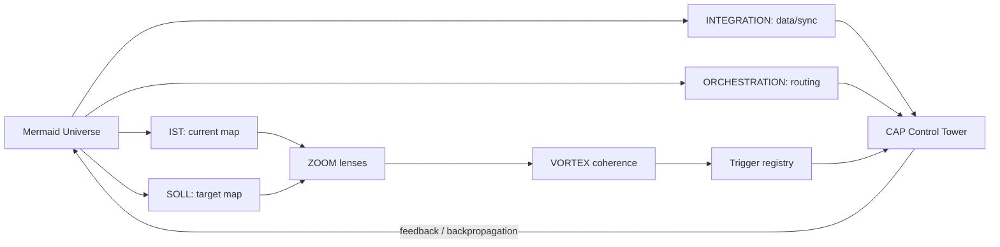

# MMD-001 - Mermaid Universe Readpass

Status: completed repo-local readpass

Date: 2026-05-17

## Decision

Mermaid becomes the first understanding layer for the trigger system.

Direct trigger reconstruction stays paused. The CAP path is now:

```text
Mermaid universe -> visual relations -> VORTEX coherence -> trigger registry
```

This avoids fake precision around the 675 documented triggers while preserving
the live structure that already exists in Notion and GitHub.

## Core Finding

The Notion Mermaid universe already carries a usable ontology:

| Layer | Meaning | CAP use |
| --- | --- | --- |
| IST | Current workspace/ecosystem map | Find where things are. |
| SOLL | Target structure | Decide where consolidation should go. |
| INTEGRATION | Data and sync flow | Separate read, pull, diff, writeback and reconciliation. |
| ORCHESTRATION | Routing and responsibility flow | Decide what actor/tool/layer handles what. |
| ZOOM | Detail lens | Focus on one subsystem without replacing the chef diagram. |
| APPENDIX | Specific slice | Keep special-purpose diagrams out of the core map. |
| DEPOT | Code/source store | Preserve renderable Mermaid code and provenance. |

The key Notion rule is important: ZOOM labels and scope run through database
properties, not only through page content. Some fetched diagram pages are blank,
but their registry properties are still meaningful.

## Living Trigger Interpretation

The Mermaid manifest supplies the bridge from diagram to trigger:

```text
Node = trigger entity
Edge = activation condition
Graph = living system
```

CAP should read that as a control rule:

- a node is a module with state, source and possible activation
- an edge is not decoration; it is the guard condition between modules
- a graph is the runnable understanding surface before any trigger register
  becomes useful

This is why MMD comes before deeper SCL or Lenhard-decoder work.

## VORTEX Bridge

VortexCanvas is not a timeline. The Notion pages describe it as a visual
decision and resonance field.

The most useful CAP mapping is:

| VORTEX element | MMD interpretation |
| --- | --- |
| Wille / intention / focus / decision | Entry vector into the graph. |
| System / rules / triggers / architecture | Structural layer of nodes. |
| Observation / feedback / resonance / correction | Backpropagation layer. |
| INIT_FEED | Impulse enters the diagram. |
| POSSIBILITY | Branches open. |
| CORE_OUT | Decision materializes. |
| VERDICHTUNG | Complexity is compressed. |
| RUECKKOPPLUNG | Learning and adaptation update the map. |

This gives the trigger field an order without forcing a brittle numbering
scheme beyond what the sources currently support.

## CAP Visual Control Model



## Operational Rule

MMD-001 establishes this order:

1. Read active Mermaid diagrams first.
2. Use diagram role and zoom properties as the first routing truth.
3. Only then map trigger modules.
4. Hash trigger/module states only after the visual route is clear.
5. Treat SCL, Lenhard module, Lenhard decoder and Schattenarchiv profiles as
   later depth layers, not as required fields for this pass.

## Gaps

| Gap | Status | Handling |
| --- | --- | --- |
| Diagram pages with blank content | Known | Trust DB properties and exported source pack until code extraction. |
| Full trigger history | Paused | Do not reconstruct in MMD-001. |
| SCL understanding | Deferred | Keep as later dedicated workstream. |
| VORTEX manifesto series | Needed | Open a later VORTEX readpass after Mermaid graph extraction. |
| Rendered graph/code mismatch | Unknown | MMD-002 should parse exports and compare against Notion registry properties. |

## Next Work

MMD-002 should extract the active Mermaid graph layer into machine-readable
tables:

- graph id
- node id
- node label
- edge source
- edge target
- guard condition
- role
- zoom layer
- source file
- source hash

That gives us the first real bridge from diagram universe to trigger registry
without pretending that the trigger canon is already fully understood.
