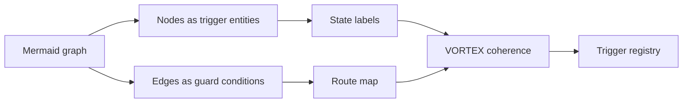

# Mermaid Cluster

Status: public atlas draft v0.1
Source: repo-local Mermaid readpass, diagram registry, read-only Notion Mermaid public/manifest review
Trace: created 2026-05-25 as public GitHub bridge for the Notion Mermaid cluster
Boundary: no raw Notion links, no raw Mermaid database dump, no private source-pack rows
Mode: SYNC / public-safe atlas publication
GitHub sync state: prepared for public GitHub review
Notion source awareness: Notion contains the living Mermaid code library and public manifesto material; this file publishes the redacted GitHub interpretation

## Definition

The Mermaid Cluster is TerraNova's visual graph layer for semantic modules,
trigger entities, guard conditions and routing structure.

The core axiom is:

```text
Node = trigger entity
Edge = activation or guard condition
Graph = living system map
```

In this model, a diagram is not only a visualization. It is a structured surface
where system concepts, states and transitions can be read by humans and later
mapped by tools.

## Public Reading

Classical diagram reading:

```text
Node = label
Edge = relationship
Graph = picture
```

TerraNova Mermaid reading:

```text
Node = module with state
Edge = route condition
Graph = runnable understanding surface
```

This does not mean every Mermaid graph is executable code today. It means the
diagram is written in a way that can become machine-readable control structure.

## Cluster Layers

The current public cluster separates these layers:

| Layer | Meaning |
| --- | --- |
| IST | Current workspace and ecosystem map. |
| SOLL | Target structure and desired system state. |
| INTEGRATION | Data flow, sync paths, read/write separation and reconciliation. |
| ORCHESTRATION | Responsibility and routing between actors, tools and modules. |
| ZOOM | Detail lens for one subsystem. |
| APPENDIX | Special-purpose diagrams outside the core map. |
| DEPOT | Source/code storage for diagram material and provenance. |

## Active Public Registry

The repo-local diagram registry currently exposes these ACTIVE names for
reviewed public orientation:

| Diagram | Role |
| --- | --- |
| Terra Nova Master Overview - Complete Workspace | Primary workspace map. |
| Digital Ecosystem - Ziel-Struktur v2.0 | Target structure map. |
| Notion <-> ChatGPT System-Architektur | Integration architecture. |
| Meta-Conductor - Agent Routing | Agent routing map. |
| Ordner 02: Codex & Trigger Detail | Trigger/codex detail lens. |
| Ordner 05: Produkte & Services Detail | Product/service detail lens. |
| Ordner 06: Technische Dokumentation Detail | Technical documentation detail lens. |
| TokenAccess - TriggerMap (988-992) | Trigger appendix. |
| Mermaid Code Library - Depot | Diagram depot. |

This list is a registry of reviewed names and roles, not a permission to publish
all underlying raw diagram source without redaction.

## Mermaid To Trigger Bridge



## Relation To SCL

SCL is the language-first layer. Mermaid Cluster is the visual-first layer.

```text
SCL term <-> Mermaid node
SCL command <-> Mermaid route
SCL boundary <-> Mermaid guard edge
```

Together they make semantic architecture visible:

```text
language field -> visual graph -> route decision -> artifact
```

## Public Canon Rule

Publish Mermaid Cluster as a graph-based understanding layer. Do not present the
current public repository as a full export of the private Notion Mermaid code
library. The public artifact is the redacted interpretation and registry bridge.

