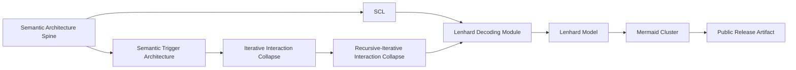

# Semantic Spine Registry

Status: public registry bridge v0.1
Source: GitHub semantic architecture spine, atlas diagram registry, curated Notion import map
Trace: created 2026-05-25 to connect the public semantic spine with atlas/source registry layers
Boundary: registry bridge only; no raw Notion URLs, no raw exports, no protected TNPX-01 draft material
Mode: SYNC / public-safe registry publication
GitHub sync state: prepared for public GitHub review
Notion source awareness: Notion remains a living source layer for selected Mermaid/SCL material; this registry publishes GitHub-visible mirrors and public-safe handles

## Purpose

This registry connects the public semantic architecture spine to the atlas and
source-routing layers. It is the public bridge between:

```text
semantic architecture docs -> atlas / Mermaid registry -> release artifact
```

## Registry Entries

| ID | Public artifact | Role | Source class | Boundary |
| --- | --- | --- | --- | --- |
| SEM-SPINE-001 | [../architecture/public_semantic_architecture_spine.md](../architecture/public_semantic_architecture_spine.md) | Entry point | GitHub synthesis | Public OK |
| SEM-TRG-001 | [../architecture/semantic_trigger_architecture.md](../architecture/semantic_trigger_architecture.md) | Trigger field model | GitHub synthesis + reviewed trigger sources | Public OK, no private trigger table |
| SCL-001 | [../architecture/semantic_core_layer.md](../architecture/semantic_core_layer.md) | Language-first control layer | GitHub synthesis + SCL source review | Public OK |
| IIC-001 | [../architecture/iterative_interaction_collapse.md](../architecture/iterative_interaction_collapse.md) | Interaction collapse loop | GitHub synthesis + CIC/IPERKA frame | Public OK |
| RIIC-001 | [../architecture/recursive_iterative_interaction_collapse.md](../architecture/recursive_iterative_interaction_collapse.md) | Recursive target layer for collapse output re-entry | GitHub synthesis + IIC/SCL/LDM relation | Target, not final public canon |
| LDM-001 | [../architecture/lenhard_decoding_module.md](../architecture/lenhard_decoding_module.md) | Signal-to-route decoder | GitHub synthesis + Lenhard/SCL review | Public OK, no personal/medical claims |
| LMODEL-001 | [../architecture/lenhard_model.md](../architecture/lenhard_model.md) | Transformation umbrella model | GitHub synthesis + CIC layer relation | Public OK, no patent grant claim |
| MMD-CLUSTER-001 | [mermaid_cluster.md](mermaid_cluster.md) | Visual trigger graph layer | GitHub readpass + Mermaid source review | Public OK, no raw Mermaid DB dump |
| PUBLIC-SEM-REL-001 | [../public/semantic_architecture_public_release_v0_1.md](../public/semantic_architecture_public_release_v0_1.md) | Citable public release artifact | GitHub synthesis | Public OK |

## Source Routing

| Source layer | Role | Public handling |
| --- | --- | --- |
| GitHub architecture docs | Versioned mirror and public synthesis | Publish directly after review. |
| GitHub atlas docs | Diagram registry and Mermaid bridge | Publish registry and redacted interpretation. |
| Notion Mermaid/SCL pages | Living source and concept workspace | Reference by source class, not raw page URLs. |
| TNPX-01 context | Historical Codex Gateway / semantic-control anchor | Handle-level context only. |
| Raw exports | Provenance and local review material | Never publish directly without redaction gate. |

## Diagram Bridge

The Mermaid Cluster remains the visual bridge for this spine:



## Release Use

This registry is the first file to check when preparing a public release,
whitepaper, Zenodo metadata refresh or external explainer based on the semantic
architecture spine.

