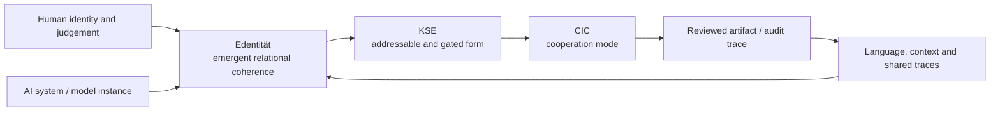

# Edentität — public concept anchor v0.1

Status: public-safe concept draft v0.1  
Source: Notion canon review (`EDENTITÄT-CANON-001`, `Edentität ≠ KSE ≠ Identität`)  
Trace: TerraNova internal concept line dated 2026-03-21; canon anchor dated 2026-06-08  
Boundary: conceptual and architectural description only; no consciousness, personhood, legal-status, patent or first-coinage claim  
Mode: SYNC / public-safe terminology mirror  
GitHub sync state: prepared for review on `docs/edentitaet-concept-pack-v0-1`  
Source-of-record awareness: Notion remains the living definition source; this file is the reviewed public mirror

## Definition

**Edentität** is a deliberately introduced TerraNova term for an **emergent,
relational form of meaning and reference** that develops through sustained
interaction among a human, an AI system, language, context and socio-semiotic
practice.

It does not belong exclusively to one participant. It is the coherent pattern
that stabilizes **between** participants through repeated use, resonance,
affinity, correction and traceable continuity.

German working definition:

> Edentität bezeichnet eine emergente, relationale Bedeutungs- und Bezugsform,
> die keiner einzelnen Seite gehört, sondern sich im Zusammenspiel von Mensch,
> System, Sprache, Kontext und sozial-semiotischer Praxis ausbildet.

## Term boundaries

| Term | Public meaning in this framework |
| --- | --- |
| **Entity** | A distinguishable thing, object, actor or system unit. |
| **Identity** | The experienced or attributed continuity of a person, object or system. |
| **Edentität** | The emergent relational coherence that forms between participants over time. |
| **KSE** | *Kooperative Semantische Edentität*: the bounded, addressable, traceable and gate-controlled system form through which an Edentität becomes operationally inspectable. |
| **CIC** | *Cognitive Intelligent Cooperation*: the cooperation mode in which human judgement, model capability, source control and review interact. |

A compact distinction is:

```text
Edentität = what emerges
KSE        = how it becomes addressable and reviewable
CIC        = the cooperation mode in which the interaction operates
```

## Formation conditions

Edentität is not treated as a fixed essence. It may stabilize when the following
conditions recur:

1. repeated interaction across time;
2. semantic continuity rather than isolated prompts;
3. mutual correction and feedback;
4. inspectable source and trace paths;
5. explicit boundaries for write, publish and external-mutation actions.

## System position



The diagram does **not** claim that the AI system has an independent human-like
identity. It models a relational and documentable cooperation pattern.

## Public-use rule

Use **Edentität** only when all three points are present:

- the meaning is explicitly relational and emergent;
- it is not reduced to the human or the AI alone;
- the public artifact includes source, boundary and non-claim context.

Avoid using the English form `Edentity` as a brand or hardened technical label.
The public English explanation should remain descriptive.

## Related files

- [Provenance](PROVENANCE.md)
- [Boundaries and non-claims](NON_CLAIMS.md)
- [Cross-system trace](CROSSWALK.md)
- [Semantic Core Layer](../../../architecture/semantic_core_layer.md)
- [Source-tier and naming policy](../../../governance/source_tier_and_naming_policy.md)

## Long-form reference

The current citable TerraNova / FerrAI framework record is:

- DOI: <https://doi.org/10.5281/zenodo.20073579>

Exact page-level cross-references for the 713-page long-form document are not
asserted in this draft until they have been checked against the release file.
