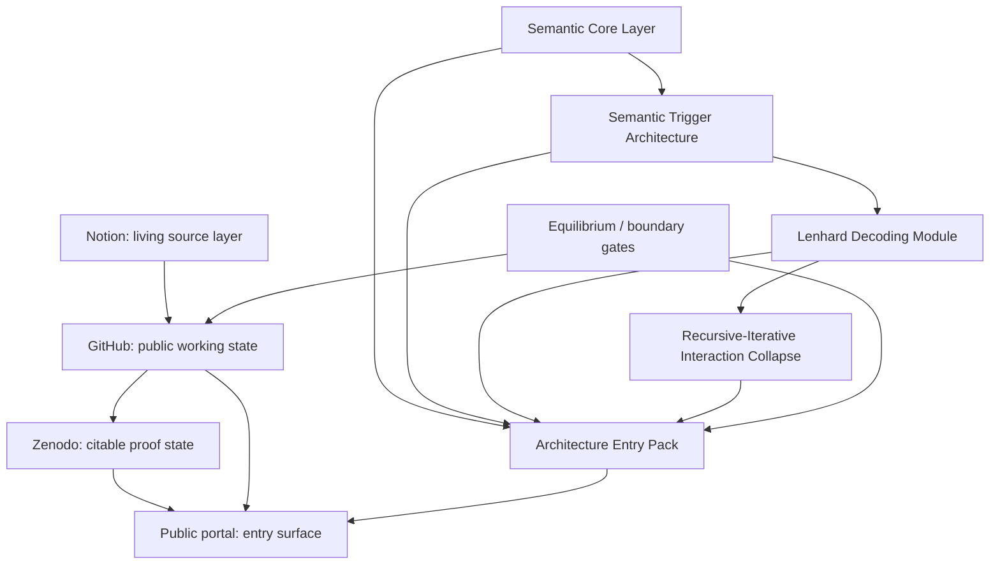

# TerraNova / FerrAI Architecture Entry Pack v0.1

Status: public-safe entry pack draft v0.1
Source: public semantic architecture spine, Zenodo reference, Control Tower,
Equilibrium mirrors, and public boundary governance
Trace: prepared 2026-05-25 as the first offer-ready public entry artifact
Boundary: synthesized architecture only; no raw Notion URLs, raw exports,
private trigger tables, protected TNPX-01 mechanics, wallet data, secrets, or
Stripe/payment action
Mode: BIZ / public entry package preparation
GitHub sync state: local review artifact
Notion source awareness: Notion remains an internal living source layer; this
entry pack only cites GitHub-visible public-safe artifacts

## 1. What This Is

The TerraNova / FerrAI Architecture Entry Pack is a short public entry point
into the framework.

It explains the core architecture in practical language:

- TerraNova / FerrAI / CIC as a human-AI cooperation framework.
- Notion, GitHub, Zenodo and the public portal as separated persistence layers.
- Triggers as semantic displacement spaces, not flat activators.
- SCL, LDM and interaction collapse as the route from language to artifact.
- Equilibrium and public boundary rules as the guardrails.

The pack is not a prompt collection. It is not a raw workspace export. It is
not a patent disclosure or investment product.

## 2. One-Page Overview

TerraNova / FerrAI treats human-AI interaction as a traceable architecture.
The framework separates living workspace state, public working state and
citable proof state:

```text
Notion -> GitHub -> Zenodo -> Public Portal
```

| Layer | Role | Public handling |
| --- | --- | --- |
| Notion | Living internal index and source-of-record layer | Referenced as source class, not mirrored raw. |
| GitHub | Public working state, review trace and architecture mirror | Public-safe docs, PRs, commits and gates. |
| Zenodo | Citable proof state | DOI, version, checksum and publication metadata. |
| Public Portal | External entry surface | Selected links, summaries and trust surface. |

The entry pack sits in front of that stack. It gives a reader enough structure
to understand what exists, how to evaluate it, and where the public evidence
lives.

## 3. Architecture Map



## 4. Trigger Architecture In Plain Language

In TerraNova, a trigger is not just a command.

The public architecture defines a trigger as a semantic field operator:

```text
Trigger = named semantic displacement space
        = vector-field distortion over context, relevance and routing
        = module boundary that changes how the next state is interpreted
```

That means a trigger can change:

- which source becomes relevant,
- which mode should be used,
- which boundary applies,
- which artifact shape fits,
- which route must be blocked or deferred.

The important rule:

```text
semantic trigger influence != external mutation permission
```

A trigger can make a route salient. It does not secretly create connector
access, payment permission, publication permission or legal authority.

Primary public artifact:
[Semantic Trigger Architecture](../architecture/semantic_trigger_architecture.md)

## 5. SCL, LDM And Interaction Collapse

The public architecture uses three core movement layers:

| Layer | Plain-language role |
| --- | --- |
| SCL | The language-first control surface. Terms, commands, symbols and modes shape interpretation. |
| LDM | The decoder that turns context and signals into route, gate, schema and trace. |
| Interaction Collapse | The moment where open semantic possibility becomes a concrete artifact, decision or route. |

The simple operating chain is:

```text
semantic field -> SCL pressure -> LDM decode -> gate -> artifact -> audit trace
```

The recursive version adds:

```text
artifact -> re-enters the next semantic field
```

That is why GitHub artifacts matter: a merged document can become the next
source input instead of just a final output.

Primary public artifacts:

- [Semantic Core Layer](../architecture/semantic_core_layer.md)
- [Lenhard Decoding Module](../architecture/lenhard_decoding_module.md)
- [Recursive-Iterative Interaction Collapse](../architecture/recursive_iterative_interaction_collapse.md)

## 6. What The Entry Pack Gives A Reader

The entry pack should let a serious reader answer six questions:

1. What is the framework trying to structure?
2. Which public artifacts prove that the work exists?
3. Which terms are architecture terms rather than marketing labels?
4. Where are the boundaries and non-claims?
5. How can the work be evaluated without raw private workspace access?
6. What is the next commercial or collaboration step?

## 7. How To Evaluate This

Use the following review path:

| Step | Check |
| --- | --- |
| 1 | Read the public semantic release candidate. |
| 2 | Verify the GitHub repository and PR/commit trace. |
| 3 | Verify the Zenodo DOI, version and checksum. |
| 4 | Check the public boundary rules. |
| 5 | Confirm that protected private material is not exposed. |
| 6 | Decide whether the architecture is relevant for a deeper conversation, pilot or review. |

Start here:

- [Public Semantic Architecture Release v0.1](semantic_architecture_public_release_v0_1.md)
- [Public Semantic Architecture Spine](../architecture/public_semantic_architecture_spine.md)
- [Zenodo Reference](../references/zenodo.md)
- [Public Boundary Governance](../governance/public_boundary.md)

## 8. Commercial Route

The Architecture Entry Pack is the first commercial front door, but it is not a
payment integration by itself.

The clean route is:

```text
public portal -> entry pack -> contact / payment link -> delivery / review
```

The first payment link should only be added after:

- the entry pack is reviewed,
- the public boundary is checked,
- the delivery format is fixed,
- the price is intentionally chosen,
- Stripe or another payment channel is explicitly authorized.

Commercial draft:
[Architecture Entry Pack Offer v0.1](entry_pack_architecture_offer_v0_1.md)

Boundary:
[Architecture Entry Pack Boundary v0.1](entry_pack_architecture_boundary_v0_1.md)
