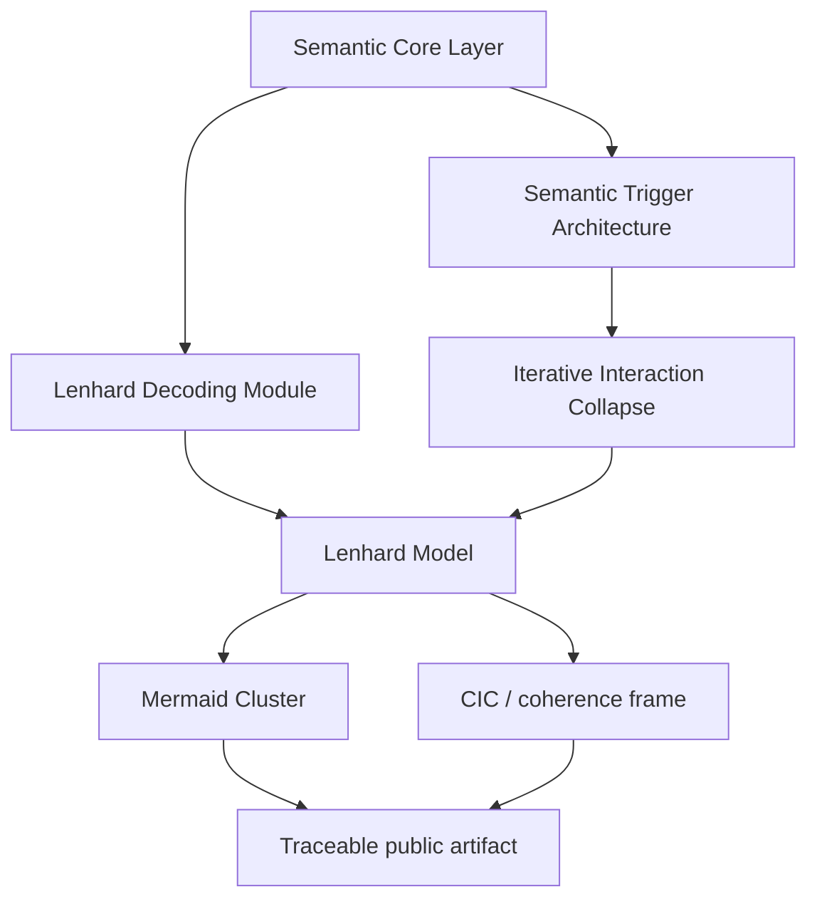

# TerraNova / FerrAI Semantic Architecture Public Release v0.1

Status: public release candidate v0.1
Source: GitHub public semantic architecture spine, atlas Mermaid Cluster bridge, public boundary governance
Trace: prepared 2026-05-25 from PR #62 follow-up work
Boundary: public-safe synthesis only; no raw Notion URLs, no raw exports, no protected TNPX-01 draft details
Mode: SYNC / citable public artifact preparation
GitHub sync state: prepared for public GitHub review
Notion source awareness: Notion remains a living source layer for Mermaid/SCL material; this artifact cites GitHub-visible redacted mirrors

## Citation Block

Suggested citation:

```text
Lenhard, Silvan. TerraNova / FerrAI Semantic Architecture Public Release v0.1.
Terra-Nova-Restore/TerraNova-s-Framework, 2026-05-25.
```

Canonical GitHub entry points:

| Layer | File |
| --- | --- |
| Architecture spine | [../architecture/public_semantic_architecture_spine.md](../architecture/public_semantic_architecture_spine.md) |
| Registry bridge | [../atlas/semantic_spine_registry.md](../atlas/semantic_spine_registry.md) |
| Mermaid Cluster | [../atlas/mermaid_cluster.md](../atlas/mermaid_cluster.md) |

## Abstract

This release defines the public TerraNova / FerrAI semantic architecture spine.
It introduces triggers as semantic displacement spaces, the Semantic Core Layer
as language-first control surface, iterative interaction collapse as the route
from semantic ambiguity to traceable artifact, the Lenhard Decoding Module as
signal-to-route decoder, the Lenhard Model as transformation umbrella, and the
Mermaid Cluster as visual trigger graph layer.

The release is a public-safe architecture synthesis. It is not a raw workspace
export, not a patent filing, not a medical model and not a claim of hidden
connector authorization.

## Core Claims

| Claim | Public status |
| --- | --- |
| A TerraNova trigger is a semantic field operator, not a flat activator. | Architecture claim |
| SCL is a language-first operating surface, not a prompt library. | Architecture claim |
| Interaction can collapse iteratively into traceable artifacts. | Workflow claim |
| LDM translates signals and context into route, gate and schema. | Architecture claim |
| The Lenhard Model connects SCL, triggers, LDM, collapse, Mermaid and CIC. | Transformation model claim |
| Mermaid diagrams can be read as living graph surfaces with nodes, edges and guards. | Documentation/modeling claim |

## Concept Map



## Public Boundary

This release keeps protected content out of the public artifact:

| Blocked detail | Public substitute |
| --- | --- |
| Raw Notion page URLs and page IDs | Source class and GitHub mirror paths |
| Raw exports and chat transcripts | Synthesized public docs |
| Protected TNPX-01 draft mechanics | Historical context anchor only |
| Private trigger tables | Semantic trigger architecture |
| Wallet, token or operational secrets | Public boundary reference only |
| Medical, psychological or legal claims | Architecture and workflow framing |

## Release Spine

| Artifact | Function |
| --- | --- |
| [Semantic Trigger Architecture](../architecture/semantic_trigger_architecture.md) | Defines trigger-as-field-operator model. |
| [Semantic Core Layer](../architecture/semantic_core_layer.md) | Defines language-first control layer. |
| [Iterative Interaction Collapse](../architecture/iterative_interaction_collapse.md) | Defines collapse from open field to artifact. |
| [Lenhard Decoding Module](../architecture/lenhard_decoding_module.md) | Defines decoder from signal to route. |
| [Lenhard Model](../architecture/lenhard_model.md) | Defines the transformation umbrella model. |
| [Mermaid Cluster](../atlas/mermaid_cluster.md) | Defines visual trigger graph interpretation. |

## Zenodo Preparation Note

This Markdown file is release-ready as a citable public artifact. A Zenodo
publication step still requires an explicit external upload/action and final
metadata review.

